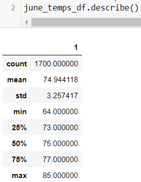
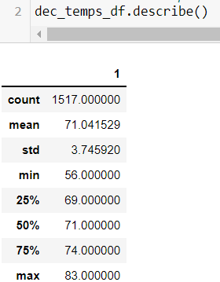
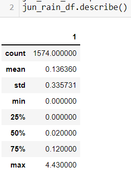
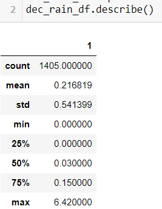

# Surfs_Up

## Overview of the analysis
The purpose of this analysis is to assist W.Avy.  W.Avy intends to open a surf shop and wants to know temperature data for the months of June and Decemeber in order to determine if ice cream sales are feasible year-round.

## Results
1) Temperatures are not very different in the months of June and December, but June is certainly less warm than December - average June temp is nearly 75 degrees, as opposed to 71 degrees in December.
2) The maximum temperature recorded in June was 85 degrees, whereas in December it was 83 - not very different.
3) The minimum temperature is the biggest differentiator, with June's min temp of 64 degrees being 8 point shigher than Decmber's min temp of 56 degrees.

## Summary

From these data, we can see that the temperature in Hawaii is usually very nice!  June is warmer than December, to be sure, with higher temps in every aggregate category: mean temp, max temp, and min temp.
However, we should also note that December has more rainfall than June.  Using the following code, one can see the differences in rainfall -->
session.query(Measurement.date, Measurement.prcp).filter(extract('month',Measurement.date)==12).all()
&
session.query(Measurement.date, Measurement.prcp).filter(extract('month',Measurement.date)==6).all()

Here are the aggregate figures:

